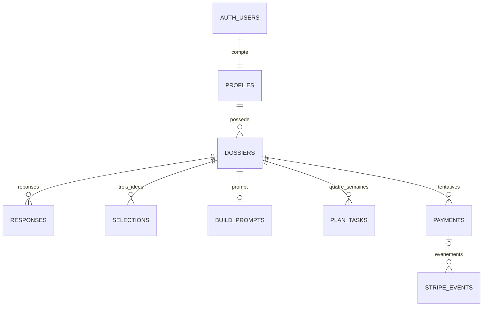

# SaaScan — proposition à valider

Cette proposition couvre l’arborescence cible et le schéma de base de données. Aucun écran, service externe ou déploiement n’est construit à ce stade. Le SQL associé est un brouillon de migration, non appliqué.

## Choix de départ

- Next.js 15, App Router, TypeScript, Tailwind CSS ; pages et lectures sensibles côté serveur, composants client pour les interactions.
- Supabase Auth par lien de connexion email, Postgres et RLS ; Resend comme SMTP de Supabase pour les liens et comme API pour les emails transactionnels.
- Stripe Checkout hébergé, achat unique de 39 € par dossier, prix et devise décidés exclusivement côté serveur.
- API Anthropic avec le modèle demandé, `claude-sonnet-4-5`, configurable par variable serveur. Sortie structurée et validation Zod locale.
- Vercel pour l’application ; génération exécutée côté serveur avec un délai borné, un verrou de dossier et une reprise explicite après échec.
- Marque blanche : un déploiement par marque, configuré dans `config/brand.ts` (nom, domaine, logo, couleur, contact, identité du vendeur). Pas de plateforme multi-entreprises dans cette première version.
- Direction visuelle : fond presque noir, accent vert acide, typographie sans-serif ample et contrastée, espace généreux, mouvements discrets et respect de `prefers-reduced-motion`.

## Arborescence cible

Les dossiers entre parenthèses organisent Next.js sans modifier les URL.

```text
saascan/
├── src/
│   ├── app/
│   │   ├── layout.tsx
│   │   ├── globals.css
│   │   ├── error.tsx
│   │   ├── not-found.tsx
│   │   ├── (public)/
│   │   │   ├── page.tsx                            # Landing /
│   │   │   ├── connexion/page.tsx
│   │   │   ├── remboursement/page.tsx
│   │   │   ├── mentions-legales/page.tsx
│   │   │   ├── cgv/page.tsx
│   │   │   ├── confidentialite/page.tsx
│   │   │   └── contact/page.tsx
│   │   ├── auth/
│   │   │   ├── callback/route.ts                   # Retour PKCE du magic link
│   │   │   ├── confirm/route.ts                    # Vérification token_hash email
│   │   │   └── deconnexion/route.ts                # POST
│   │   ├── (protected)/
│   │   │   ├── layout.tsx                         # Auth et navigation
│   │   │   ├── app/page.tsx                       # Liste / reprise des dossiers
│   │   │   ├── questionnaire/[id]/page.tsx
│   │   │   ├── generation/[id]/page.tsx
│   │   │   ├── debloquer/[id]/page.tsx             # Paywall
│   │   │   └── dossier/[id]/page.tsx              # Vérifie aussi le droit payé
│   │   └── api/
│   │       ├── auth/magic-link/route.ts            # POST, limitation des envois
│   │       ├── dossiers/route.ts                  # POST créer un brouillon
│   │       ├── dossiers/[id]/route.ts             # GET état et progression
│   │       ├── dossiers/[id]/responses/route.ts    # PUT réponse via RPC
│   │       ├── dossiers/[id]/export/route.ts       # GET .md, accès payé
│   │       ├── generate/route.ts                  # POST matching et génération
│   │       ├── checkout/route.ts                  # POST session Stripe
│   │       ├── plan-tasks/[id]/route.ts            # PATCH { done: boolean }
│   │       ├── remboursement/route.ts             # POST demande authentifiée
│   │       ├── webhooks/stripe/route.ts            # POST signature + transaction
│   │       └── internal/retry-emails/route.ts      # Reprise protégée des envois
│   ├── components/
│   │   ├── ui/                                   # Boutons, champs, accordion, focus
│   │   ├── layout/                               # En-tête, footer, navigation
│   │   ├── landing/                              # Les 7 sections du brief
│   │   ├── auth/magic-link-form.tsx
│   │   ├── questionnaire/                        # Une question, progression, reprise
│   │   ├── generation/analysis-progress.tsx
│   │   ├── paywall/locked-preview.tsx
│   │   └── dossier/                              # Idées, copie/export, plan coché
│   ├── config/
│   │   ├── brand.ts
│   │   ├── pricing.ts
│   │   └── plan-weeks.ts                         # Un objectif par semaine
│   ├── lib/
│   │   ├── env.ts                                # Validation des variables
│   │   ├── auth/                                 # Session vérifiée, retour URL local
│   │   ├── supabase/
│   │   │   ├── browser.ts
│   │   │   ├── server.ts                         # Client lié au JWT utilisateur
│   │   │   ├── admin.ts                          # server-only, service_role
│   │   │   └── middleware.ts                     # Rafraîchissement des cookies
│   │   ├── questionnaire/
│   │   │   ├── questions.ts                      # 20 questions, 5 blocs
│   │   │   ├── schemas.ts                        # Validation par question
│   │   │   └── profile.ts                        # Réponses → profil comparable
│   │   ├── matching/
│   │   │   ├── filters.ts                        # Contraintes éliminatoires
│   │   │   ├── scoring.ts                        # Classement des idées restantes
│   │   │   └── idea-rules.ts                     # Effort et canaux autorisés
│   │   ├── generation/
│   │   │   ├── anthropic.ts
│   │   │   ├── schemas.ts                        # 3 idées, prompt, 4 semaines
│   │   │   ├── instructions.ts
│   │   │   ├── service.ts                        # Verrou, reprise, publication atomique
│   │   │   └── word-count.ts                     # 700 à 900 mots
│   │   ├── dossiers/                             # Lecture, accès payé, export
│   │   ├── stripe/                               # Checkout, signature, fulfillment
│   │   ├── email/                                # Resend, envois idempotents
│   │   └── security/                             # Quotas, origine, erreurs publiques
│   ├── emails/
│   │   ├── dossier-disponible.tsx
│   │   └── remboursement-recu.tsx
│   ├── types/database.ts                         # Types issus du schéma Supabase
│   └── middleware.ts                             # Convention Next.js 15
├── data/ideas.json                               # 20 idées écrites à la main
├── public/brand/                                 # Logo, favicon et visuels
├── supabase/
│   ├── config.toml
│   ├── templates/magic-link.html
│   ├── migrations/
│   │   ├── 202609120001_initial_schema.sql        # À partir du SQL proposé
│   │   └── 202609120002_server_transactions.sql   # Génération et paiements atomiques
│   └── tests/rls.sql
├── tests/
│   ├── matching.test.ts
│   ├── generation.test.ts
│   ├── stripe-webhook.test.ts
│   └── e2e/parcours.spec.ts
├── docs/
│   ├── architecture-proposee.md
│   └── schema-propose.sql
├── .env.example
├── .gitignore
├── next.config.ts
├── postcss.config.mjs
├── tsconfig.json
├── eslint.config.mjs
├── vitest.config.ts
├── playwright.config.ts
├── vercel.json
├── package.json
├── package-lock.json
└── README.md
```

## Modèle de données

Le SQL complet se trouve dans [schema-propose.sql](./schema-propose.sql). Il conserve les sept tables métier demandées et ajoute un journal technique des événements Stripe.

| Table | Rôle | Contraintes principales |
|---|---|---|
| `profiles` | Compte synchronisé avec Supabase Auth | Un profil par utilisateur, email issu de l’auth |
| `dossiers` | Propriétaire, progression, génération et droit d’accès | Statut technique séparé de `paid_at` et `refunded_at` |
| `responses` | Réponses sauvegardées | Une réponse par dossier/question, JSON borné, 20 identifiants autorisés |
| `selections` | Trois idées classées et personnalisées | Rangs 1–3 uniques, pas de doublon d’idée, canal et réponses citées |
| `build_prompts` | Prompt de l’idée classée première | Un prompt par dossier, 700–900 mots |
| `plan_tasks` | Tâches des quatre semaines | Semaine 1–4, position 1–7, seul `done` modifiable par l’utilisateur |
| `payments` | Tentatives de Checkout et remboursement | Session unique, 3 900 centimes EUR, propriétaire cohérent avec le dossier |
| `stripe_events` | Déduplication et suivi des webhooks/emails | Identifiant Stripe unique, aucun accès client |



La banque reste dans le fichier JSON demandé. `selections.idea_id` est donc validé contre ce fichier par le serveur, sans fausse clé étrangère SQL. Un `idea_snapshot` conserve le contenu de l’idée au moment de la génération ; les anciens dossiers restent stables quand la banque évolue.

## Accès et sauvegarde

- RLS activée sur les huit tables. Aucune lecture anonyme des données métier.
- Un utilisateur lit son profil, ses dossiers, ses réponses et ses paiements.
- Les sélections, prompts et tâches exigent simultanément : dossier du compte connecté, statut `pret`, `paid_at` renseigné et `refunded_at` absent. Ces règles s’appliquent aussi à un appel direct à Supabase.
- L’utilisateur ne peut modifier ni le propriétaire, ni le statut, ni les montants, ni `paid_at`. Les écritures privilégiées passent uniquement par le serveur.
- La sauvegarde d’une réponse passe par une fonction SQL étroite : utilisateur vérifié, verrou du dossier, statut `brouillon`, puis insertion ou mise à jour. Ce verrou évite qu’une réponse change pendant la prise en charge d’une génération.
- Pour les tâches, permission SQL `UPDATE(done)` uniquement, doublée d’une policy propriétaire + dossier payé. La RLS ne limite pas à elle seule les colonnes modifiables. [Documentation Supabase](https://supabase.com/docs/guides/database/postgres/column-level-security)
- Les lectures applicatives emploient le client Supabase du compte connecté. Le client `service_role` est réservé aux opérations serveur qui en ont besoin ; il ne sert pas aux lectures courantes des dossiers.
- Pas de cache partagé des pages privées, des exports ou des réponses API. Les textes générés sont rendus sans HTML brut.

## Questionnaire et matching

Les identifiants SQL correspondent aux vingt questions prévues :

| Bloc | Identifiants | Effet dans le dossier |
|---|---|---|
| Point de départ | `temps_semaine`, `budget_depart`, `revenus_en_ligne`, `delai_premier_euro` | Capacité de construction, outils abordables, niveau d’accompagnement, ordre des actions commerciales |
| Compétences | `niveau_code`, `aisance_ia`, `niveau_design`, `niveau_vente`, `niveau_video` | Faisabilité technique, stack, tutoriel, interface MVP, scripts et formats d’acquisition |
| Terrain | `secteur`, `communautes`, `audience`, `reseau_pro`, `langues` | Niche, premiers prospects, canal existant et langue du produit |
| Contraintes | `montrer_visage`, `demarchage_froid`, `risque` | Canaux exclus, coût et incertitude acceptables, ampleur du MVP |
| Goût | `types_produits`, `taches_detestees`, `ambition` | Classement, automatisations prioritaires et rythme du plan |

Les questions de revenus et d’audience peuvent contenir plusieurs champs courts sur le même écran. Les échelles ont des ancrages concrets. Les options fixent des tranches explicites ; aucun choix « ça dépend ».

Le filtrage ne compare pas directement des jours de développement et des heures par semaine : chaque idée possède une estimation d’effort dans `idea-rules.ts`. Elle est comparée à la capacité déclarée sur la fenêtre de construction de la semaine 2 ; `temps_mvp_jours` reste également contraint par le calendrier. Les règles indiquent les canaux possibles et leurs prérequis (visage, démarchage, vidéo, audience). Une idée reste admissible seulement si au moins un canal concret respecte le profil.

On conserve au plus huit idées admissibles. S’il en reste trois à sept, Claude choisit parmi elles. S’il en reste moins de trois, on explique les contraintes bloquantes et on permet de corriger le questionnaire ; aucune contrainte n’est ignorée pour remplir artificiellement le résultat. Le choix « marketplace » conduit à un outil pour un acteur existant, jamais à une place de marché à deux faces à amorcer.

## Génération et reprise

`POST /api/generate` reçoit uniquement le `dossier_id`. Le serveur relit les vingt réponses en base, vérifie leur schéma et applique les filtres. Une transaction réserve le dossier avant tout appel payant ; les doubles clics et requêtes simultanées ne lancent pas deux générations.

Le cycle technique est `brouillon → generation → pret`, ou `generation → echec` en cas d’erreur. Une reprise incrémente `generation_attempts`. Un résultat d’une ancienne tentative ne peut pas écraser celui d’une tentative récente. La fermeture d’un navigateur n’est pas une garantie d’exécution en arrière-plan : l’état persistant permet de retrouver un résultat terminé ou de relancer une tentative expirée. Les délais de fonction Vercel seront configurés et vérifiés lors du déploiement.

Claude reçoit les candidats et le profil, sans adresse email ni identifiant de compte. Il doit citer les réponses utilisées, choisir trois identifiants existants, fournir l’adaptation, le premier canal et le risque de chaque idée, puis le prompt et quatre semaines de tâches. La validation serveur impose trois idées distinctes, un prompt de 700 à 900 mots et cinq à sept tâches par semaine. Une réponse tronquée ou refusée ne devient jamais un dossier prêt.

Correction de syntaxe du brief : l’API Anthropic documente `output_config.format` avec un schéma JSON et l’intégration Zod, plutôt qu’un paramètre `response_format`. Les contraintes métier sont revérifiées localement. [Documentation Anthropic](https://platform.claude.com/docs/en/build-with-claude/structured-outputs)

La publication des trois sélections, du prompt, des tâches et du statut `pret` sera une transaction SQL serveur. Le SQL proposé pose les tables, leurs accès et la sauvegarde ; la seconde migration prévue implémentera cette publication ainsi que les transitions de paiement après validation de l’architecture.

## Paywall et paiement

Le paywall affiche trois cartes verrouillées avec un aperçu de structure clairement présenté comme tel. Le flou est visuel ; les noms d’idées, identifiants de sélection et contenus complets ne sont pas envoyés au navigateur avant paiement. Un simple retrait du CSS ne révèle donc rien.

Checkout est ouvert seulement pour un dossier prêt appartenant au compte connecté. Une session en cours est réutilisée ou expirée avant d’en créer une autre. Le serveur fixe `mode: payment`, 3 900 centimes et EUR ; le montant ne provient jamais du navigateur.

Le webhook vérifie la signature sur le corps brut, puis la session, le propriétaire, le dossier, le montant, la devise et le statut réellement payé. Un `checkout.session.completed` non payé ne débloque rien. Les événements de succès différé seront traités si ces moyens de paiement sont activés. La page de retour Checkout attend la confirmation en base. [Documentation Stripe](https://docs.stripe.com/checkout/fulfillment)

L’événement Stripe, le paiement et `dossiers.paid_at` seront traités dans une transaction atomique. Un événement déjà traité devient une opération sans effet. Les remboursements réussis mettent à jour le cumul remboursé ; un remboursement total renseigne `refunded_at` et ferme les futurs accès. Un événement de paiement reçu en retard ne doit jamais réouvrir un dossier remboursé.

Le journal conserve l’état de l’email transactionnel. Le paiement reste acquis si Resend échoue ; les envois sont repris avec une clé d’idempotence stable, indépendamment du traitement du paiement.

La page `/remboursement` expose la garantie de 14 jours demandée et permet de soumettre une demande liée au dossier. Le remboursement Stripe reste une opération serveur de traitement de la demande. L’identité du vendeur et les coordonnées légales seront nécessaires avant publication ; aucun renseignement légal ne sera inventé.

## Ordre de construction après validation

1. Socle du projet, thème et configuration de marque ; landing et pages d’information.
2. Connexion et espace personnel minimal ; schéma Supabase et politiques testées.
3. Questionnaire complet avec sauvegarde et reprise.
4. Banque des vingt idées, matching, génération et états d’erreur.
5. Paywall, Checkout, webhook et emails.
6. Dossier complet, copie/export du prompt et tâches persistantes.
7. Vérification du parcours à 390 px, clavier et bureau ; README, variables et déploiement Vercel.

Les contrôles prioritaires porteront sur l’isolement entre deux comptes, l’impossibilité d’accéder au contenu impayé ou remboursé, le refus des modifications de colonnes sensibles, la sauvegarde/reprise, les contraintes du matching, les générations simultanées et les webhooks répétés ou reçus dans un ordre différent.
